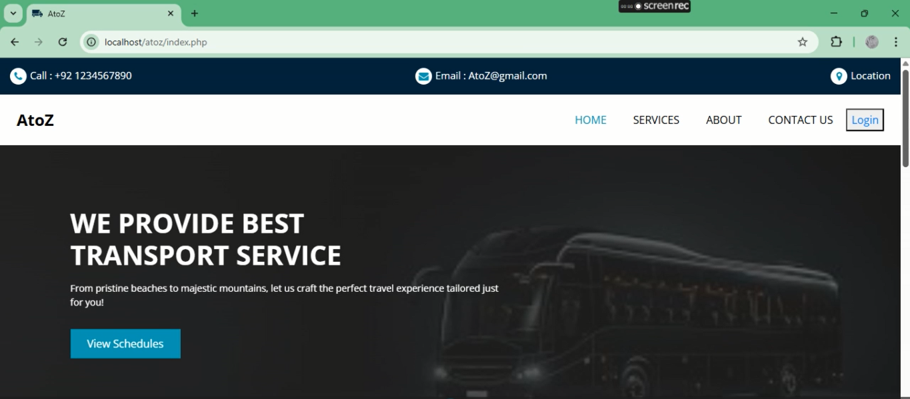
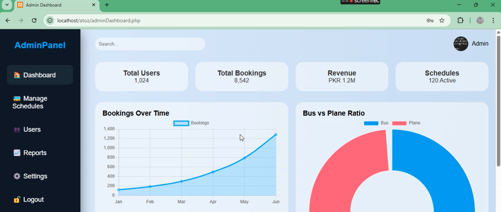
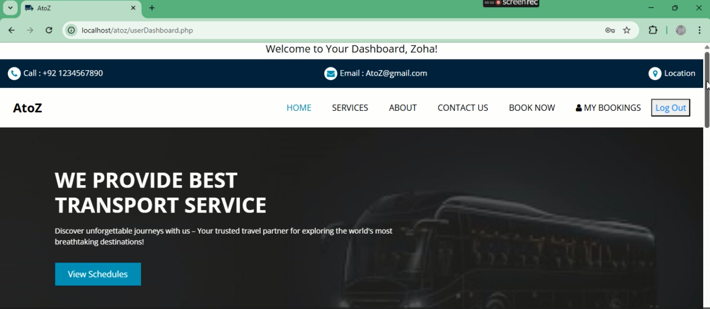

# Travel Management System

## Description
The Travel Management System is a full-stack web application designed to manage travel bookings, users, and administrative tasks efficiently. It features a **user-friendly frontend** for clients to browse and book travel options, and a **secure admin dashboard** for managing bookings, users, and travel packages.  

This project was built completely with HTML, CSS, Bootstrap, JavaScript, PHP, and MongoDB, with a focus on responsive design, clean UI, and practical functionality.

## Tech Stack
- HTML5  
- CSS3  
- Bootstrap  
- JavaScript  
- PHP  
- MongoDB  

## Features

### User Side
- Browse and search travel packages  
- Booking forms with proper validation  
- User account management  
- Responsive design for desktop and mobile  
- Interactive UI elements using JavaScript  

### Admin Side
- Admin Dashboard to manage users and bookings  
- View, approve, or reject travel bookings  
- Add, update, or delete travel packages  
- Secure login for admin  
- Dashboard analytics and tables for quick insights  

## Screenshots

### User Side
  
  

### Admin Side
  
  

